# Energy Production Forecasting

## Oil and Gas Production Analysis and Forecasting in Colombia

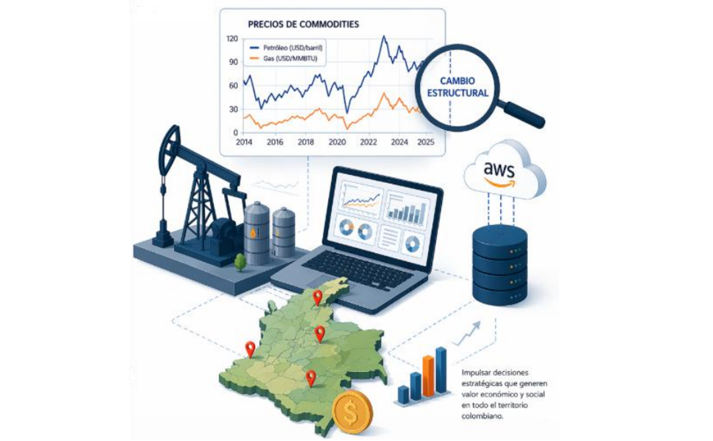

---

# Project Description

Energy markets are highly dynamic and influenced by multiple economic, geopolitical, and technical factors.

This project analyzes and predicts **oil and gas production in Colombia**, as well as its relationship with **international energy commodity prices**.

The project integrates several areas of data analytics:

* Data Engineering
* Exploratory Data Analysis
* Machine Learning Models
* Time Series Models
* Forecasting

The goal is to build models capable of **predicting the future evolution of energy production and analyzing its relationship with international prices**.

---

# Data Sources

The datasets used in this project come from official public sources.

## Hydrocarbon Production

Source:

Colombia Open Data Portal
National Hydrocarbons Agency (**ANH**)

The datasets contain monthly information about:

* Crude oil production
* Natural gas production
* Oil fields
* Operators
* Geographic location

---

## Commodity Prices

Source:

Federal Reserve Economic Data (**FRED**)

Series used:

* Brent crude oil price
* Henry Hub natural gas price

---

## Period Analyzed

The data covers the period:

**2014 – 2025**

This time range allows the analysis of:

* production trends
* seasonality
* price volatility
* forecasting scenarios

---

# Data Architecture

The project follows a modern data architecture based on the **Medallion Architecture** approach.

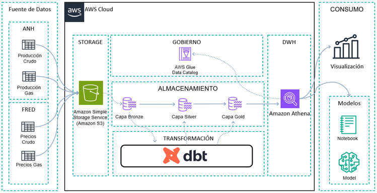

The architecture is divided into three main layers.

### Bronze Layer

Contains the original raw data downloaded from external sources without modifications.

### Silver Layer

In this layer, data cleaning, standardization, and transformation processes are performed.

### Gold Layer

A dimensional model and analytical tables are created for analysis, visualization, and predictive models.

This architecture allows:

* improving data quality
* ensuring data traceability
* enabling analytical and predictive analysis

---

# Exploratory Data Analysis

Exploratory analysis helps understand the historical behavior of production and prices.

The main objectives of the EDA were:

* identify production trends
* detect seasonality
* analyze volatility
* explore relationships between variables

Example of production evolution:

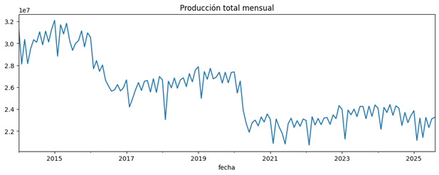
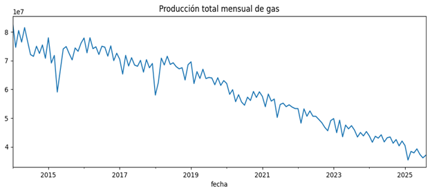
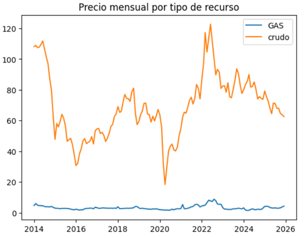

Main findings:

* Oil production shows a long-term declining trend.
* Gas production presents seasonal patterns.
* International prices show high volatility.

Correlation analysis shows that **the relationship between production and price is very low**, therefore both variables must be modeled independently.

---

# Time Series Analysis

To better understand production dynamics, time series decomposition was performed into:

* Trend
* Seasonality
* Residual component

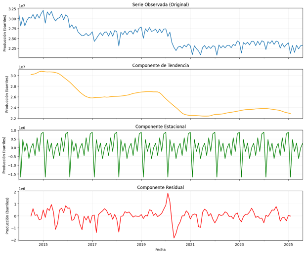
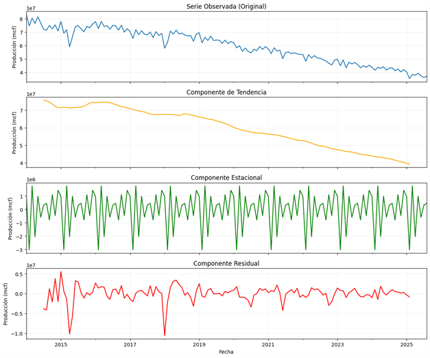

This technique allows understanding the underlying structure of the data and designing more robust forecasting models.

Monthly price returns were also analyzed.

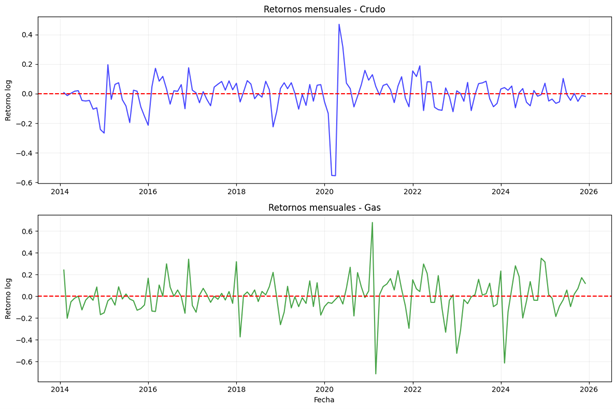

---

# Predictive Models

Different forecasting approaches were evaluated.

## Statistical Models

* SARIMA
* Prophet

## Machine Learning Models

* XGBoost

## Deep Learning Models

* LSTM
* GRU

The models were trained using:

* lag variables
* temporal variables
* feature engineering

Prediction examples:

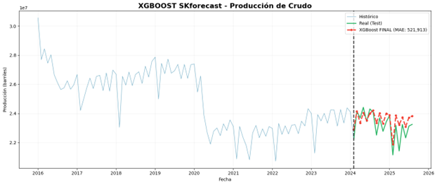
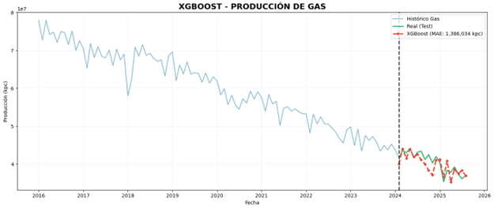

---

# Model Evaluation

Model performance was evaluated using standard forecasting metrics:

* MAE
* MAPE
* R²

The results show that **Machine Learning models achieved the best performance**, outperforming both traditional statistical models and deep learning models.

This is mainly due to the dataset size and the effectiveness of the feature engineering applied.

---

# Forecast Scenarios

The best-performing models were used to generate **12-month forecasts** for:

* oil production
* gas production
* commodity prices

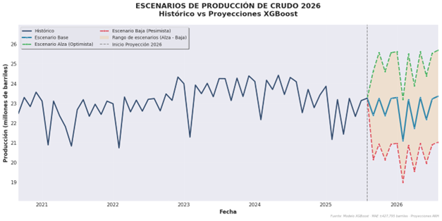

An economic sensitivity matrix was also created for commodities due to different possible price scenarios.

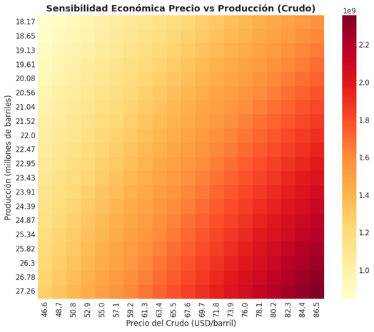

These predictions help analyze potential future scenarios and support decision-making processes in the energy sector.

For more information about the project, you can read the full research document attached below.


---

# Technologies Used

Python
Pandas
NumPy
Matplotlib
Seaborn

Scikit-learn
XGBoost
TensorFlow
Keras

Prophet
Statsmodels

Jupyter Notebook

---

# Repository Structure

```
project
│
├── Data
│   ├── Produccion_Crudo.csv
│   ├── Produccion_Gas.csv
│   ├── precio_crudo.csv
│   ├── precio_gas.csv
│   └── README.md
│
├── notebook_forecasting.ipynb
│
├── requirements.txt
│
└── README.md
```

---

# Author

Johan Mauricio Suarez Daza

Data Engineer | Data Scientist

Master in Big Data Analytics
Universidad Europea de Madrid
