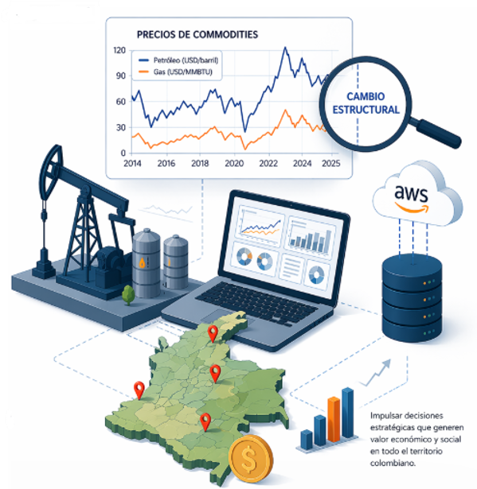

# Energy Production Forecasting

## Oil & Gas Production and Commodity Price Analysis



## Project Overview

Energy markets are highly dynamic and influenced by multiple economic, technical and geopolitical factors.

This project focuses on analyzing and forecasting **oil and gas production in Colombia** and exploring its relationship with **international commodity prices**.

The project integrates:

* Data engineering
* Exploratory data analysis
* Machine learning models
* Forecasting techniques

The goal is to build predictive models capable of estimating **future production trends and price dynamics** using historical data.

---

# Data Sources

The datasets used in this project come from publicly available sources:

### Production Data

Source:
Open Data Portal of Colombia and the **Agencia Nacional de Hidrocarburos (ANH)**

These datasets include monthly production information for:

* Oil production
* Natural gas production

### Commodity Prices

Source:
Federal Reserve Economic Data (**FRED**)

Price series used:

* Brent crude oil price
* Henry Hub natural gas price

The combined dataset covers the period:

**2014 – 2025**

---

# Data Architecture

The project follows a **modern data architecture based on the Medallion approach**.


The pipeline consists of three main layers:

**Bronze Layer**

Raw data ingestion from external sources.

**Silver Layer**

Data cleaning and transformation.

**Gold Layer**

Dimensional model and analytical tables used for analysis and machine learning models.

This architecture ensures:

* Data quality
* Reproducibility
* Scalable analytics workflows

---

# Exploratory Data Analysis

The exploratory analysis focuses on identifying:

* Production trends
* Seasonality
* Structural changes
* Relationships between variables

Example of production evolution:


Key findings:

* Oil production shows a declining long-term trend.
* Gas production exhibits seasonal patterns.
* Commodity prices present high volatility.

Correlation analysis revealed **very low correlation between production and prices**, suggesting independent modeling strategies.

---

# Time Series Analysis

To understand the dynamics of production data, the time series were decomposed into:

* Trend
* Seasonality
* Residual component


This decomposition allows us to better understand the underlying structure of the data and design more robust forecasting models.

---

# Machine Learning Models

Several forecasting approaches were evaluated.

### Statistical Models

* SARIMA
* Prophet

### Machine Learning Models

* XGBoost

### Deep Learning Models

* LSTM
* GRU

The models were trained using lag features and temporal variables.

Example prediction:


---

# Model Performance

The evaluation was performed using common forecasting metrics:

* MAE
* MAPE
* R²

Results show that **Machine Learning models outperform traditional statistical and deep learning approaches** due to the dataset size and feature engineering strategy.

---

# Forecast Scenarios

The best-performing models were used to generate **12-month forecasts** for:

* Oil production
* Gas production
* Commodity prices


These projections can support:

* strategic planning
* production optimization
* economic scenario analysis

---

# Technologies Used

Python
Pandas
NumPy
Matplotlib
Seaborn

Scikit-learn
XGBoost
TensorFlow
Keras

Prophet
Statsmodels

Jupyter Notebook

---

# Repository Structure

```

project
│
├── Data
│ ├── Produccion_Crudo.csv
│ ├── Produccion_Gas.csv
│ ├── precio_crudo.csv
│ ├── precio_gas.csv
│ └── README.md
│
├── forecasting.ipynb
│
├── requirements.txt
│
└── README.md

```

---

# Author

Johan Mauricio Suarez Daza

Data Engineer | Data Scientist

Master in Big Data Analytics
Universidad Europea de Madrid
